# Electricity Sales Forecasting with Automated MLOps & Dashboard

## 📌 Project Overview
This project builds an **end-to-end machine learning pipeline** for forecasting monthly residential electricity sales in New Jersey.  
It demonstrates how to build a lightweight and automated forecasting pipeline with **data ingestion, preprocessing, modeling, evaluation, automation, and visualization**, using Supabase, GitHub Actions, and Streamlit.

## 🎯 Purpose
- Forecast monthly residential electricity sales in NJ using SARIMA and a benchmark model.
- Automate the ingestion, training, and forecasting workflows.
- Store all results (data, models, forecasts) in **Supabase** for centralized management.
- Visualize actuals vs forecasts and model performance metrics in a **Streamlit dashboard**.
- Provide an example of lightweight, cloud-friendly MLOps.

## 📊 Data
- **Source**: [EIA (U.S. Energy Information Administration)](https://www.eia.gov/)  
- **Frequency**: Monthly  
- **Granularity**: NJ Residential Electricity Sales (aggregated)  
- **Storage**: Raw and processed datasets stored in **Supabase Object Storage / Postgres DB**.

## 🤖 Modeling
- Models
    - **SARIMA**: Seasonal ARIMA model tailored for monthly electricity demand patterns.  
    - **Benchmark**: Seasonal Naive model (last year’s same month value).  
- Forecast Horizon: One-step ahead monthly forecast 
- Evaluation Metrics (computed against available actuals):
    - Mean Absolute Error (MAE)
    - Root Mean Squared Error (RMSE)
    - Mean Absolute Percentage Error (MAPE)

## 🏗️ Architecture

## ⚙️ Tools & Stack
- **Data & Storage**: Supabase (Postgres + Buckets)
- **Modeling**: Python (Statsmodels)
- **Automation**: GitHub Actions (cron-based scheduled workflows)
- **Dashboard**: Steamlit

## 🔄 Automation
A GitHub Actions workflow runs monthly to run two scripts: 
1. monthly_data_ingest: Fetch latest EIA data and store results.
2. monthly_forecast: Generate forecasts and store results.

## 📈 Dashboard
👉 [Open Live Dashboard](https://nj-electricity-forecast.streamlit.app/)  

The **Streamlit dashboard** provides:
- **Main graph**: Time series of actual electricity sales vs SARIMA & benchmark forecasts.
- **Sidebar filters**:
    - Model selector
    - Date range selector
    - Evaluation period selector (last 1, 3, 6, 12 months)
- **Evaluation metrics**: Displayed as grouped bar charts (metrics × models).

## 🚀 Deployment
Streamlit app deployed via Streamlit Community Cloud.

